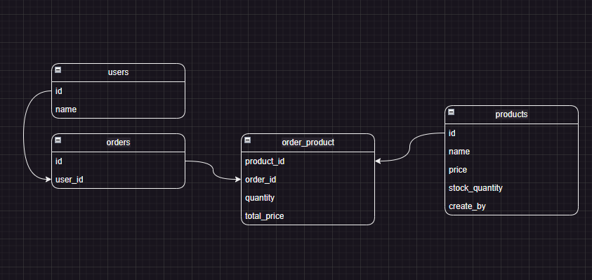
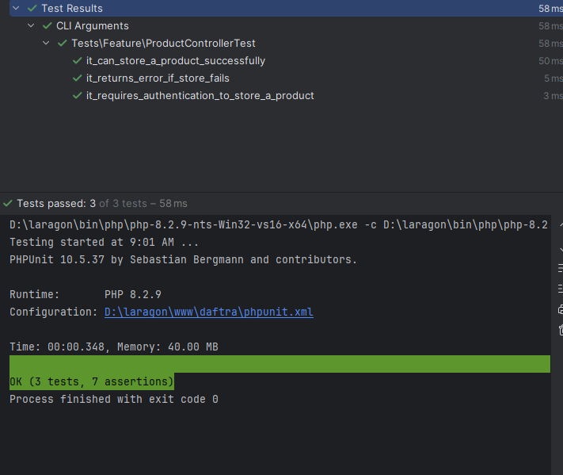

# Daftra

## Prerequisites

Before getting started, make sure you have the following installed:
- **Git**
- **Docker & Docker Compose** (recommended)
- **PHP 8.0+**
- **SQLite extension**
- **Make** (optional, for Linux and Windows if installed)

## Step 1: Clone the Repository

Clone the repository using:

```bash
git clone git@github.com:coder0010/daftra.git
```

Alternatively, download it directly from [GitHub](https://github.com/coder0010/daftra) or use the GitHub Desktop application.

Navigate to the project directory:

```bash
cd daftra
```

## Step 2: Configure the Environment

1. Copy the `.env.example` file to create a new environment configuration file:

    ```bash
    cp .env.example .env
    ```

2. Modify the `.env` file as needed to set up your environment variables.

### Option A: Running with Docker (Recommended)

If Docker is installed, use the following commands to build and run the application:

**For Windows:**

```bash
docker-compose down --rmi all --volumes --remove-orphans && docker-compose up -d
```

**For Linux (or Windows with Make installed):**

```bash
make build
```

### Option B: Running without Docker

Ensure **PHP 8.0+** with **SQLite extension** is installed, and run the following:

```bash
echo NULL > storage/logs/laravel.log
php artisan migrate
php artisan passport:install --force
```

## Step 3: Start the Application

Start the Laravel server:

```bash
php artisan serve
```

Your application will be accessible at: [http://127.0.0.1:8000](http://127.0.0.1:8000) for normal setup


Your application will be accessible at: [http://127.0.0.1:8001](http://127.0.0.1:8001) for docker (port comming from builded container in env file)

---

## Step 4: For runing the unit test

    php artisan test

---

## Step 5: Erd Design of Database




## Step 6: ScreenShot From Testing



---

## Additional Commands

- **Stopping Docker Services**:

    ```bash
    docker-compose down
    ```

- **Restarting Docker Services**:

    ```bash
    docker-compose up -d
    ```

## Troubleshooting

- **Permission Issues**: Ensure correct permissions for Docker commands or PHP scripts.
- **Configuration Problems**: Verify your `.env` file if facing issues with database connections or environment settings.
- **Error Logs**: Check `storage/logs/laravel.log` for details on any errors.

### Notes

- If you are using Make on Windows, you can run Linux commands directly have alook on make file (it's only for docker services).
- Review and adjust the `.env` file as per your local or production environment settings.

